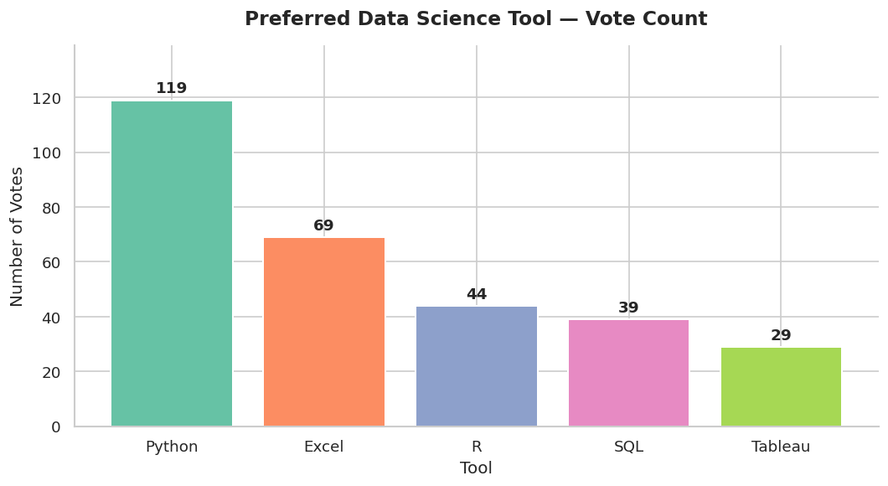
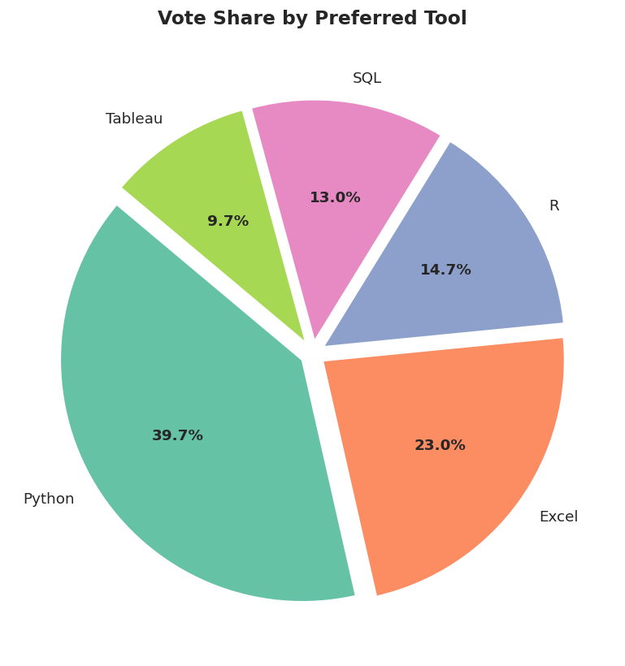
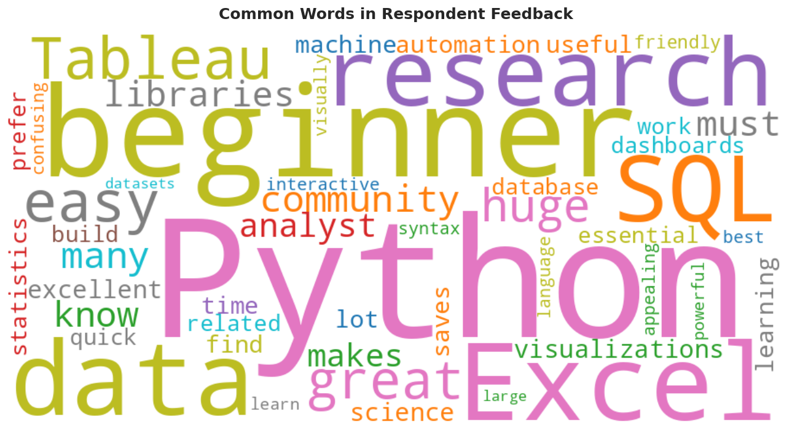

# Poll-Results-Visualizer
Interactive poll data analysis dashboard built with Python, Pandas, Matplotlib and Streamlit.

# 📊 Poll Results Visualizer

An interactive dashboard to analyse and visualise poll/survey data.

## 🔧 Tech Stack
- Python, Pandas, NumPy
- Matplotlib, Seaborn, WordCloud
- Streamlit (dashboard)

## 📌 Features
- Vote count and share analysis
- Region-wise breakdown
- Demographic comparison (age, gender)
- Feedback word cloud
- Auto-generated insights
- Filter by region, age, tool, satisfaction

## 🚀 How to Run
pip install -r requirements.txt
streamlit run app.py

## 📊 Sample Charts

## 👤 Author
Made by Ishwari Belhekar | Data Science Student
